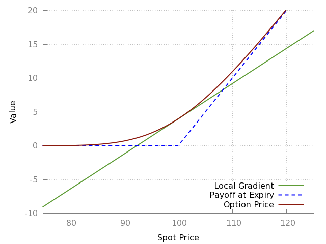
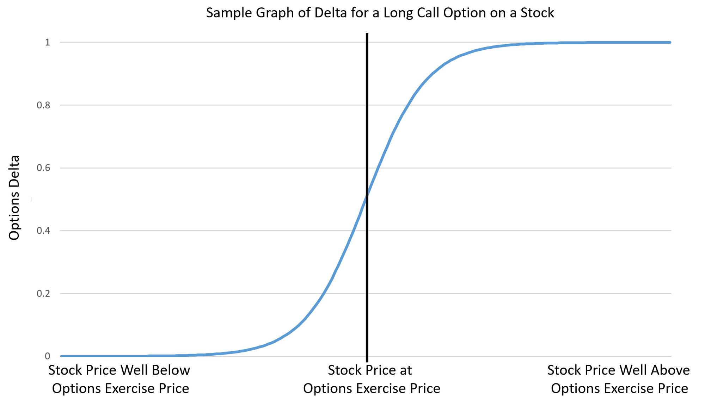

Squeezemetrics paper

H TODOs:

- read https://nope-its-lily.medium.com/a-story-of-liquidity-volatility-and-returns-754e0019c2d0
- read https://sixfigureinvesting.com/2019/02/what-caused-the-february-5th-2018-volatility-spike-xiv-termination/
- read https://spotgamma.com/all-you-ever-wanted-to-know-about-gamma/
- read https://spotgamma.com/options-gamma-trap/ - likely integrate

This post is a deeper look into the world of market making, and what happens when things get weird. If you've heard terms like _gamma hedging_ or _gamma squeeze_, or seen people mention the more mysterious Greeks like vanna and charm, this post is for you. I will cover:

- fill
- this
- list
- in

## Prerequisites

This is not really beginner stuff any more. I'm not going to start drawing formulas at you, but you'll find this one much harder to get by without a grounding in the basics.

**TODO: fix the below link**

You should understand everything in [this post](understanding-NOPE), plus:

- A strong understanding of these options greeks: delta, theta, vega

As before, all this information is widely available on the internet.

---

topics:

- gamma hedging
- gamma squeeze
- what is vanna, and how can it mess things up
- what is charm

# Delta, theta, and vega: not enough on their own

In the last post we walked through how a market maker hedges their risk were you to buy SPY calls from them [TODO: link]. At the beginning of the example, the delta on those calls was 0.52, but then the underlying rise and the option went further in-the-money:

> And because the option is further in-the-money now, **delta is a little bigger**, say 0.54. So if the spot price of SPY moves up $1, the total price adjustment for the calls you sent me would be $54.

I glossed over something which I've bolded here: why did delta change? To understand that, we need to think a bit more about what delta really represents.

This is the payoff graph for a call option, something you've doubtless seen before:

<small>A payoff graph for a call option. [<a href="https://www.tradingcampus.in/option-greeks/">source</a>]</small>

The maroon curve is the one we're interested in for now, showing the value of the option for various spot prices some time before expiry. The green line is the tangent to that curve at the current spot price, and **the slope of that line is the option's delta**.

You can think about it from the other perspective, if you like: if you plotted the definiton of delta ("the change in option value for a $1 change in spot price"), you'd get a `y = mx + c` straight line where `m = delta`.

So: we have a curved option payoff line, and a tangent line delta. As with all tangent lines, delta is only a useful predictor for a change in options value for small changes in the underlying spot price: for larger changes, the curve moves away from the tangent line. That's why in our example, delta got adjusted: the spot price moved, so the slope of the tangent line increased.

Can we quantify this adjustment? Yes. It's a higher-order Greek called **gamma**.

## Gamma

Gamma describes the _curve_ of the options payoff line. It is defined as **the change in delta for every $1 the spot price moves**.

You'll notice this is different to the Greeks you know so far. Delta, theta, and vega all describe the change in the option price; gamma describes the change in _delta_. We say Gamma is a **second-order** Greek.

### Gamma hedging

Let's think back to our market maker from the example. They were delta hedging, and having to do so repeatedly. Since gamma explains why they had to update their delta hedge, can our MM _gamma hedge_ and save ourselves the trouble? Well... yes and no.

This time I'll let someone else explain it (you only need to watch as far as 9m35s):

<iframe width="560" height="315" src="https://www.youtube.com/embed/GCAM8UyCitE" frameborder="0" allow="accelerometer; autoplay; clipboard-write; encrypted-media; gyroscope; picture-in-picture" allowfullscreen></iframe>

So yes, gamma hedging is possible: ultimately it's just a system of simultaneous equations like you learned in high school. Notice that the option used for gamma hedging also provides some amount of delta hedge, reducing the number of shares you need to buy (compared to a delta-only hedge). Of course, you've now bought some options, so the person who sold you them will have to hedge the delta on _those_ options - so the same number of shares have to be bought anyway, you're just pushing around who has to do it.

But if you're a MM and already in the business of writing options, why would you go buy an option from a different MM? You could write it yourself for cheaper, but then you'd need to hedge _that_ option! In doing so you'd buy all the shares you were trying to avoid in the first place. Seems pointless.

### What's a gamma squeeze?

You may have heard the term **gamma squeeze** (or sometimes gamma trap) mentioned lately, probably in the context of GameStop. What is this?

Let's go back to that payoff graph from earlier:

<small>The same payoff graph we saw earlier. [<a href="https://www.tradingcampus.in/option-greeks/">source</a>]</small>

And let's recap a few things we know:

* Delta is the tangent to the payoff curve
* Gamma reflects how delta changes as spot price changes, or the _curviness_ of the curve
* MMs respond to the effects of gamma by adjusting their share position in the underlying

Looking at the graph, where does gamma have the biggest effect? Where is the curve _curviest_?

It's curviest at that curvy bit. That place happens to be at the strike price of the option: that is to say, gamma is highest when the stock price is close to the option's strike price.

You can see this on a graph of delta against the spot price, i.e. plotting the slope of the green line on the y-axis:

<small>Delta at different spot prices. [<a href="https://www.fool.com/investing/2021/01/28/what-is-a-gamma-squeeze//">source</a>]</small>

The slope of _this_ line is gamma - the change in delta per $1 change in the underlying. (Yup, we're secretly doing calculus! Sorry!)

Observe:

* Delta is low when the stock price is well below the options price. If your option is far out of the money, a $1 move in stock price doesn't do much, because your option is still worthless.
* Delta is as high as it can be - approaching 1 - when the stock price is way above the option strike price. This corresponds to your option being very deep in the money: the chance it'll move out of the money are very low, so a $1 move in stock price is just going to make your option (almost) $1 more expensive.

Where is _gamma_ highest? The slope of the delta line is highest when the option is at the money. This makes sense: if your option is either deep in or deep out of the money, a small change in stock price isn't going to affect the option price very much - its fate is already sealed, so gamma is low. But if it's at the money, it could make all the difference (imagine it's expiration day - a $1 move is the difference between your option being worth zero or something!).

So: as the stock price nears (and crosses) the strike price of an option - through the middle section of that S graph - delta starts increasing rapidly. This means that MMs have to buy lots more shares to hedge their risk, pushing the stock price upwards.

As the stock price moves upwards, it enters the high-gamma zone of the _next option strike up_, forcing MMs who sold _those_ options to buy more shares.

Other people on the sidelines see the share price spike, and want to follow the trend. Which strike should a smart investor buy to maximize their return for the least investment? At-the-money! And _another_ MM has to buy shares of the underlying, and up and up and up we go!

_This_ is a gamma squeeze. It typically happens on an option expiry day, where the high-gamma zone has compressed to a near-vertical line. A sudden shift in price can force MMs to buy a _lot_ of shares of the underlying quickly, triggering a cascade effect.

SpotGamma has [a great writeup of how this happened with GameStop](https://spotgamma.com/gme-gamma-squeeze/).

## Other higher-order Greeks

https://en.wikipedia.org/wiki/Greeks_(finance)

---

# References

SpotGamma's whole business is based around understanding gamma:
- [The Options Gamma Trap](https://spotgamma.com/options-gamma-trap/)
- 

SqueezeMetrics has written some great papers on this kind of behaviour:

- [Gamma Exposure: Quantifying hedge rebalancing in SPX options](https://squeezemetrics.com/download/white_paper.pdf)
- [The Implied Order Book](https://squeezemetrics.com/download/The_Implied_Order_Book.pdf)

KeyPaganRush on YouTube has some good videos:

- [Gamma and Vanna Exposures](https://www.youtube.com/watch?v=zfkOCc2evEk)
- [Vanna and Charm Exposure](https://www.youtube.com/watch?v=-RhSCoElB9Y)

Other stuff:

- [Advanced Options Greeks](https://www.youtube.com/watch?v=ngweIHiKOUg) - good visualisations of how higher greeks 
- [Option Charts](http://devqf.com/optioncharts/optioncharts.htm) - interactive tool showing you how different greeks behave

