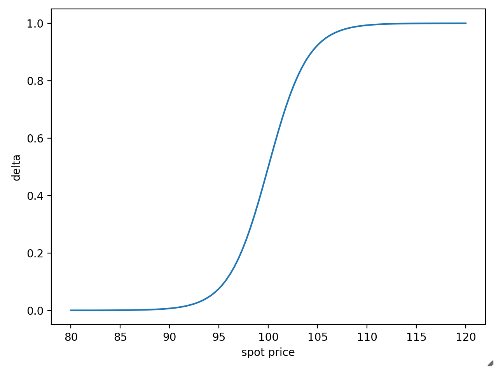
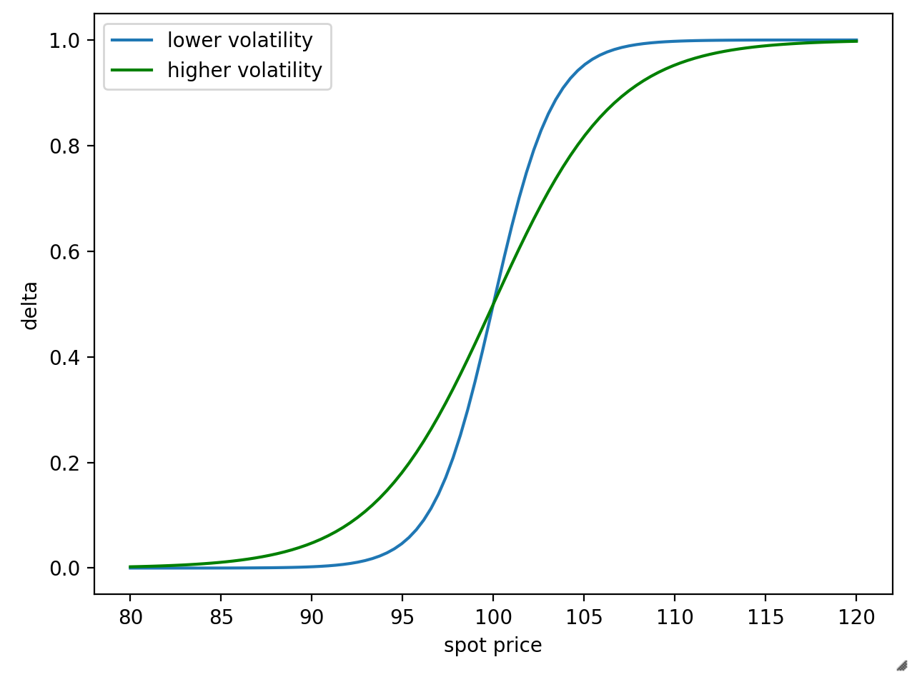

This post is a deeper look into the world of market making, and what happens when things get weird. If you've heard terms like _gamma hedging_ or _gamma squeeze_, or seen people mention the more mysterious Greeks like vanna and charm, this post is for you. I will cover:

- fill
- this
- list
- in

## Prerequisites

This is not really beginner stuff any more. I'm not going to start drawing formulas at you, but there will be graphs.

**TODO: fix the below link**

I assume more background knowledge this time around. You should understand everything in [the previous post](understanding-NOPE), plus:

- A strong understanding of these options greeks: delta, theta, vega
- The order book and how it works, specifically the difference between limit and stop orders

As before, all this information is widely available on the internet.

---

topics:

- gamma hedging
- gamma squeeze
- what is vanna, and how can it mess things up
- what is charm

# Delta, theta, and vega: not enough on their own

In the last post we walked through how a market maker would hedge their risk were you to buy SPY calls from them [TODO: link]. At the beginning of the example, the delta on those calls was 0.52, but then the underlying rose and the option went further in-the-money:

> And because the option is further in-the-money now, **delta is a little bigger**, say 0.54. So if the spot price of SPY moves up $1, the total price adjustment for the calls you sent me would be $54.

I glossed over something which I've bolded here: why did delta change? To understand that, we need to think a bit more about what delta really represents.

This is the payoff graph for a call option, something you've doubtless seen before:

<small>A payoff graph for an at-the-money call option at the $100 strike. [<a href="https://www.tradingcampus.in/option-greeks/">source</a>]</small>

The reddish curve is the one we're interested in for now, showing the value of the option for various spot prices some time before expiry. The green line is the tangent to that curve at the current spot price, and **the slope of that line is the option's delta**.

You can think about it from the other perspective, if you like: if you plotted the definiton of delta ("the change in option value for a $1 change in spot price"), you'd get a `y = mx + c` straight line where `m = delta`.

So: we have a curved option payoff line, and a tangent line delta. As with all tangent lines, delta is only a useful predictor for a change in options value for small changes in the underlying spot price: for larger changes, the curve moves away from the tangent line. That's why in our example, delta got adjusted: the spot price moved, so the slope of the tangent line increased.

Can we quantify this adjustment? Yes. It's a higher-order Greek called **gamma**.

## Gamma

Gamma describes the _curvature_ of the options payoff line. It is defined as **the change in delta for every $1 the spot price moves**, and it's what's responsible for MMs having to adjust their share position in the underlying as price moves.

You'll notice this is different to the Greeks you know so far. Delta, theta, and vega all describe the change in the option price; gamma describes the change in _delta_. We say Gamma is a **second-order** Greek. 

Where is gamma highest on the payoff graph? Or, to ask the question another way: where is the curve _curviest_? There, at that curvy bit, _exactly at the strike price of the option_.

You can see this on a graph of delta against the spot price, i.e. plotting the slope of the green line on the y-axis:

<small>Delta at different spot prices. [<a href="https://www.fool.com/investing/2021/01/28/what-is-a-gamma-squeeze//">source</a>]</small>

The slope of _this_ line is gamma - the change in delta per $1 change in the underlying. (Yup, we're secretly doing calculus! Sorry!)

Observe:

* Delta is low when the stock price is well below the option's strike price. If your option is far out of the money, a $1 move in stock price doesn't do much, because your option is still worthless.
* Delta is as high as it can be - approaching 1 - when the stock price is way above the option's strike price. This corresponds to your option being very deep in the money: the chance it'll move out of the money are very low, so a $1 move in stock price will make your option (nearly) $1 more expensive.

Where is _gamma_ highest? The slope of the delta line is highest when the option is at the money. This makes sense: if your option is either deep in or deep out of the money, a small change in stock price isn't going to affect the option price very much - its fate is already sealed, so gamma is low. But if it's at the money, it could make all the difference (on expiration day a tiny move is the difference between your option being worth something and nothing!).

Gamma is positive when you hold a long option, either a call or a put: if the spot price goes up $1, the delta will increase. (Remember that puts have negative delta, so increasing their delta reduces their value.) In this case we say you have a _long gamma_ position.

On the other hand, if you sold an option to someone, your gamma is negative: if the spot price goes up $1, your delta will decrease. We say you are _short gamma_.

### Gamma hedging

Let's think back to our market maker. They were delta hedging, and having to do so repeatedly. Since gamma explains why they had to update their delta hedge, can our MM "gamma hedge" and save the constant fiddling? Well... yes and no.

This time I'll let someone else explain it (you only need to watch as far as 9m35s, but keep going if you like):

<iframe width="560" height="315" src="https://www.youtube.com/embed/GCAM8UyCitE" frameborder="0" allow="accelerometer; autoplay; clipboard-write; encrypted-media; gyroscope; picture-in-picture" allowfullscreen></iframe>

So yes, gamma hedging is possible: ultimately it's just a system of equations like you learned in high school. Notice that the option used for gamma hedging also provides some amount of delta hedge, reducing the number of shares you need to buy (compared to a delta-only hedge). Of course, you've now bought some options, so your seller will have to hedge the delta on them. Ultimately the same number of shares have to be bought anyway, you're just pushing around who has to do it.

Also: if you're a MM and already in the business of writing options, why would you go buy an option from a different MM? You could write it yourself for cheaper, but then you'd need to hedge _that_ option! In doing so you'd buy all the shares you were trying to avoid in the first place. Seems pointless.

### When Gamma Goes Bad

In the last post we saw that buying options from MMs amplifies price movement, and selling options to MMs stabilizes it. We can now use our understanding of gamma to explain this differently:

* MMs who are _short gamma_ have their delta reduced when spot price increases. They have to buy shares to bring their delta back up to zero, thus amplifying the price.
* MMs who are _long gamma_ have their delta increased when spot price increases. They have to sell shares to bring their delta back down to zero, providing a counter force to the price increase.

In our example, as the stock price nears (and crosses) the strike price of our call - through the middle section of that S graph - the delta of the option starts increasing rapidly. This is when our MM's hedging requires they buy the largest number of shares to neutralize the delta decrease (from their perspective) of their position.

The state of the order book matters a lot for what happens next. If the order book has enough limit sells, the MM buys will hit them, be absorbed, and that'll be it. This is what happens most of the time. However, if the order book is thin - if few people are selling - then MMs are forced to buy at higher prices, pushing the stock price upwards.

As the stock price moves upwards, it may start to enter the high-gamma zone of the next option strike up, forcing MMs who sold _those_ options to buy more shares.

Other people on the sidelines see the share price spike, and want to follow the trend. Which option should a smart investor buy to maximize their return for the least investment? An at-the-money call! And now _another_ MM has to buy shares of the underlying, and up and up and up we go!

This is a **gamma squeeze** (sometimes known as a "gamma trap"). It typically happens on an option expiry day, where the high-gamma zone has compressed to a near-vertical line: a sudden shift in price can force MMs to buy a _lot_ of shares of the underlying quickly, triggering a cascade effect if the order book is thin enough.

In early 2021 GameStop was the perfect storm for a gamma squeeze: people buying up and refusing to sell shares of the underlying, and a lot of option buying activity. SpotGamma has [a great writeup of how it all played out](https://spotgamma.com/gme-gamma-squeeze/).

One of the effects of a gamma squeeze is increased option buying. This bids up the price, which is the same as bidding

There is another counter-force that helps prevent gamma squeezes: option buying increases IV. An increase in volatility widens the possible range of prices at expiration, effectively spreading out the delta curve, which in turn reduces gamma and reduces the number of shares a MM has to buy to hedge any given change in spot price:

<small>Delta with different volatility. [<a href="https://www.fool.com/investing/2021/01/28/what-is-a-gamma-squeeze//">source</a>]</small>

The change in

### Another reason that gamma squeezes don't happen

gamma vanna exp 5m09: https://www.youtube.com/watch?v=zfkOCc2evEk

- buying lots of options increases IV
  - this decreases delta (the S curve gets S-ier / less straight)
- the grid of graphs in the squeezemetrics paper is gamma vs spot price, centred on the strike
    - this means the _shaded area_ is delta
    - you're gonna have to reread the paper carefully and internalise it :)

- maybe make a version of the delta graph that shows two S curves at different expiries/IVs
    - frame this as stretching or squishing the S

If this "rising share prices forces more share buying" situation sounds familiar to you, good job. In the previous post we talked about MMs having to buy shares of the underlying to hedge call options, the same behaviour we see go out of control during a gamma squeeze. In a sense, NOPE is tracking mini-squeezes happening over the day, as a run of hedging activity triggers more hedging by other MMs. Usually the mini-squeeze burns itself out, since there are usually enough limit orders in the order book to absorb the MM trades.

## Other higher-order Greeks

https://en.wikipedia.org/wiki/Greeks_(finance)

# Thinking about this in terms of liquidity

pull back in our mention from part 1 of how MMs short options amplifies price movements; talk about that in terms of the order book

https://nope-its-lily.medium.com/a-story-of-liquidity-volatility-and-returns-754e0019c2d0

(not sure if there's anything to this section or if i'm trying to chase the KeyPaganRush videos)

vol overview https://www.macrodesiac.com/your-volatility-handbook/

# Further reading

Volpocalypse: https://sixfigureinvesting.com/2019/02/what-caused-the-february-5th-2018-volatility-spike-xiv-termination/

# References

SpotGamma's whole business is based around understanding gamma:
- [The Options Gamma Trap](https://spotgamma.com/options-gamma-trap/)
- [All You Ever Wanted To Know About Gamma](https://spotgamma.com/all-you-ever-wanted-to-know-about-gamma/) is as  comprehensive as the title implies.

SqueezeMetrics has written some great papers on this kind of behaviour:

- [Gamma Exposure: Quantifying hedge rebalancing in SPX options](https://squeezemetrics.com/download/white_paper.pdf)
- [The Implied Order Book](https://squeezemetrics.com/download/The_Implied_Order_Book.pdf)

KeyPaganRush on YouTube has some good videos:

- [Gamma and Vanna Exposures](https://www.youtube.com/watch?v=zfkOCc2evEk)
- [Vanna and Charm Exposure](https://www.youtube.com/watch?v=-RhSCoElB9Y)

Other stuff:

- [Advanced Options Greeks](https://www.youtube.com/watch?v=ngweIHiKOUg) - good visualisations of how higher greeks 
- [Option Charts](http://devqf.com/optioncharts/optioncharts.htm) - interactive tool showing you how different greeks behave

